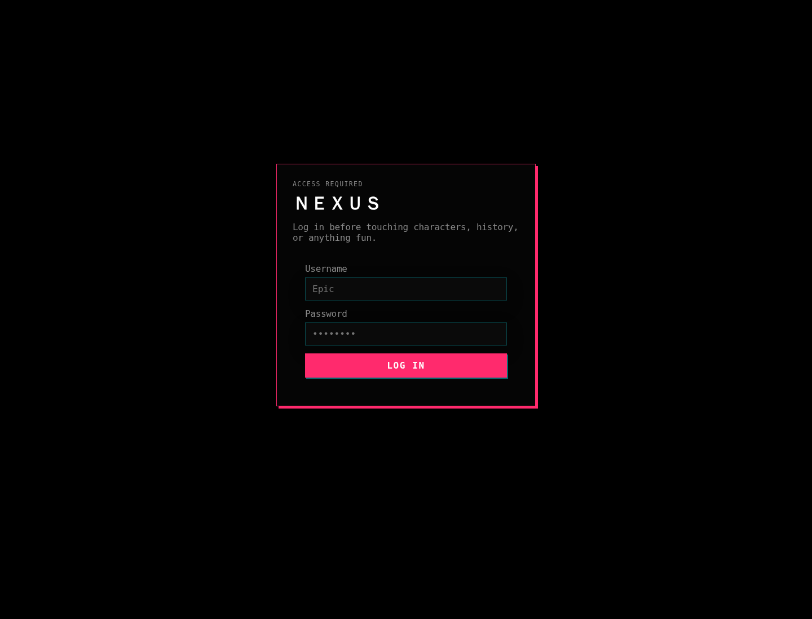

# NEXUS Docs

- [Setup guide](SETUP.md)
- [Feature guide](FEATURES.md)
- [API reference](API.md)
- [Deployment notes](DEPLOYMENT.md)
- [OpenClaw bridge](OPENCLAW_BRIDGE.md)

## Screenshot

The in-app API docs are also available as a static page in [`public/nexus-api.html`](../public/nexus-api.html).
